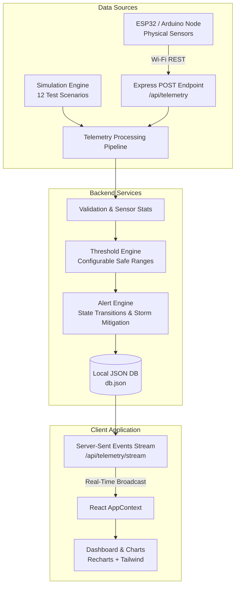

# Water Quality Assessment Tool for On-Site Water Monitoring

An advanced Environmental IoT monitoring dashboard and telemetry processing platform built to support continuous water monitoring, threshold diagnostics, and real-time alarms. This project runs completely locally without external dependencies (such as physical sensors or online clouds) using a stateful telemetry simulation engine, but is architected to transition instantly to physical ESP32 boards.

---

## 1. System Architecture

The software architecture enforces a clean separation of concerns, ensuring that the frontend dashboard remains data-agnostic—consuming telemetry packets identically whether streamed from the simulator or received from a physical ESP32 micro-controller over Wi-Fi.



---

## 2. Technology Stack

* **Frontend**:
  * **React (Vite)**: Component-based client SPA framework.
  * **Tailwind CSS**: Custom dark/light styling system with water conservation palettes.
  * **Recharts**: Time-series charts, area visualizers, scatter charts, and donuts.
  * **Lucide React**: Clean vector environmental icons.
  * **Framer Motion**: Subtle animations for cards and alerts.
  * **React Router**: Client-side routing.
  * **Axios**: HTTP request routing.
* **Backend**:
  * **Node.js + Express**: REST API endpoints, routing, and static file servers.
  * **Server-Sent Events (SSE)**: Uni-directional live telemetry streaming connection.
  * **JSON DB**: A persistent JSON file store (`backend/data/db.json`) that seeds default device entries, logs, and thresholds.

---

## 3. Data Models

The system matches the database entity relationships specified in the project report:

### Device
Represents a deployed on-site telemetry station:
```json
{
  "deviceId": "WQM-001",
  "name": "Water Quality Monitor 01",
  "type": "ESP32 Water Quality Station",
  "location": "Demo Station North",
  "latitude": 12.9716,
  "longitude": 77.5946,
  "status": "ONLINE",
  "connectionType": "Wi-Fi",
  "lastSeen": "2026-08-16T06:10:00.000Z",
  "firmware": "v1.0.4",
  "sensors": [
    { "name": "pH", "status": "OK", "quality": 98.7 },
    { "name": "Temperature", "status": "OK", "quality": 99.2 }
  ]
}
```

### Telemetry Reading (SensorReading)
Compact document recording metrics:
```json
{
  "id": "WQM-001-1718544000000",
  "deviceId": "WQM-001",
  "timestamp": "2026-08-16T06:10:00.000Z",
  "ph": 7.24,
  "temperature": 25.4,
  "turbidity": 1.4,
  "tds": 312,
  "dissolvedOxygen": 7.2,
  "source": "simulation",
  "status": "normal"
}
```

### Threshold
```json
{
  "ph": {
    "parameter": "ph",
    "unit": "pH",
    "warningLow": 6.5,
    "warningHigh": 8.5,
    "criticalLow": 6.0,
    "criticalHigh": 9.0
  }
}
```

### Alert
```json
{
  "id": "alert-1718544000000",
  "deviceId": "WQM-001",
  "parameter": "ph",
  "value": 9.24,
  "threshold": 9.0,
  "severity": "critical",
  "message": "ph (9.24 pH) exceeded critical limit (9.0 pH)",
  "status": "active",
  "timestamp": "2026-08-16T06:10:02.000Z",
  "acknowledgedAt": null,
  "resolvedAt": null
}
```

---

## 4. REST API Endpoint Mapping

| Method | Endpoint | Description |
| :--- | :--- | :--- |
| **GET** | `/api/devices` | Returns registered nodes list. |
| **GET** | `/api/devices/:id` | Returns diagnostic info for specific node. |
| **GET** | `/api/telemetry/latest/:deviceId` | Returns latest telemetry packet. |
| **GET** | `/api/telemetry/history/:deviceId` | Returns logs (supports `limit`). |
| **POST** | `/api/telemetry` | Receives raw telemetry (simulated or ESP32). |
| **GET** | `/api/alerts` | Returns historical alerts list. |
| **GET** | `/api/alerts/active` | Returns current active alerts. |
| **POST** | `/api/alerts/acknowledge/:id` | Acknowledges an active alert. |
| **GET** | `/api/thresholds` | Returns warning/critical limit mappings. |
| **PUT** | `/api/thresholds/:parameter` | Updates configured limits on the backend. |
| **GET** | `/api/sensor/health/:deviceId` | Returns quality stats and error counts. |
| **GET** | `/api/telemetry/stream` | Opens Server-Sent Events (SSE) live connection. |
| **POST** | `/api/simulation/start` | Starts the simulation loop timer. |
| **POST** | `/api/simulation/pause` | Pauses data generation. |
| **POST** | `/api/simulation/scenario` | Changes active scenario profile. |

---

## 5. Live Simulation Scenarios

The simulator supports 12 testing scenarios to demonstrate all operational logic:
1. **Normal Water**: Parameters drift naturally inside safe boundaries.
2. **High pH**: Gradually raises pH level past 9.5 (simulates alkaline dump).
3. **Low pH**: Gradually lowers pH level below 5.2 (simulates acidic run-off).
4. **High Turbidity**: Rises turbidity past 11.0 NTU (simulates silting/heavy rain).
5. **High TDS**: Rises total mineral count past 900 ppm.
6. **Low Dissolved Oxygen**: Drops DO below 3.5 mg/L (simulates high biological load).
7. **High Temperature**: Raises temperature past 38°C (simulates thermal discharge).
8. **Multiple Parameter Failure**: Rises pH, Turbidity, TDS and drops DO simultaneously.
9. **Sensor Failure**: Simulates electrode failure; pH drops to `null`. Card flags `ERROR`.
10. **Device Offline**: Disconnects station WQM-001. System flags offline and logs alert after a timeout.
11. **Gradual Recovery**: Moves all parameters back toward normal, then returns to standard monitoring.
12. **Random Fluctuations**: Loops standard fluctuations with periodic random anomalies.

---

## 6. How to Run Locally

### Prerequisites
* Node.js (v18+)
* NPM (v9+)

### Step 1: Run the Backend Server
```bash
cd backend
npm install
npm start
```
The server will boot on `http://localhost:5000`. It will create a `backend/data/db.json` database automatically and begin generating simulation ticks.

### Step 2: Run the React Frontend
```bash
cd frontend
npm install --legacy-peer-deps
npm run dev
```
The client dashboard opens on `http://localhost:3000`.

---

## 7. Future ESP32 / Hardware Integration

To switch from simulation mode to physical ESP32 hardware:
1. **Network Config**: Connect the ESP32 to the same local Wi-Fi network as the laptop running the backend server.
2. **REST API Transmission**: Configure the ESP32 code to make HTTP POST requests to the backend server IP:
   ```cpp
   // C++ Arduino Skeleton for ESP32
   #include <WiFi.h>
   #include <HTTPClient.h>

   const char* ssid = "WiFi_SSID";
   const char* password = "WiFi_PASSWORD";
   const char* serverUrl = "http://[YOUR_SERVER_IP]:5000/api/telemetry";

   void setup() {
     Serial.begin(115250);
     WiFi.begin(ssid, password);
     while (WiFi.status() != WL_CONNECTED) { delay(500); }
   }

   void loop() {
     if (WiFi.status() == WL_CONNECTED) {
       HTTPClient http;
       http.begin(serverUrl);
       http.addHeader("Content-Type", "application/json");

       // Read physical sensors here (calibration math)
       float ph = readPhSensor(); 
       float temp = readTempSensor();
       float turb = readTurbiditySensor();
       float tds = readTdsSensor();
       float doVal = readDoSensor();

       String payload = "{\\"deviceId\\":\\"WQM-001\\",\\"ph\\":" + String(ph) + 
                        ",\\"temperature\\":" + String(temp) + 
                        ",\\"turbidity\\":" + String(turb) + 
                        ",\\"tds\\":" + String(tds) + 
                        ",\\"dissolvedOxygen\\":" + String(doVal) + "}";

       int httpResponseCode = http.POST(payload);
       http.end();
     }
     delay(5000); // Send reading every 5 seconds
   }
   ```
3. **Automatic Switch**: As soon as the backend receives a POST request on `/api/telemetry` with source `hardware_api`, the database registers it. The header updates from `SOURCE: SIMULATION` to `SOURCE: ESP32 / API` dynamically.
